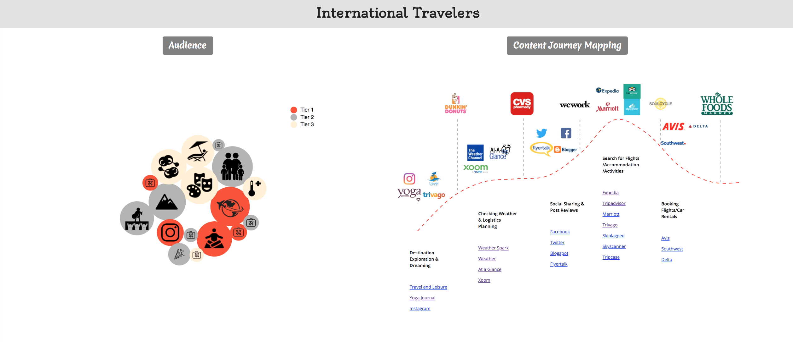

# D3_Travel_Mindsets
This is a demo of D3 animated bubbles chart, radar chart and sunburst with dashed-line animations. 
The visualization contains two parts. The "audience" part presents the 11 travel mindsets, their sizing, characteristics and emotional mapping. The "Content" part shows the online web browsing and offline store visiting journeys as well as social and video contents in the four traveling phases. 

## Demo available here

The inspiration is from [Michael Currie's github](https://github.com/MichaelCurrie/bubble_chart)
